# Hướng dẫn sử dụng: xếp thời khóa biểu (TKB)

Bản ngắn cho nhà trường: cài đặt, các bước trên trang nhập liệu, đọc kết quả, sửa giữa năm. Các hình chụp từ
**trường mẫu tên giả** (`tkb/truong_mau.py`). Chi tiết từng cột, từng luật: [README](../README.md); đặc tả đầy đủ:
[Dac_Ta_Nghiep_Vu_TKB_V16.md](Dac_Ta_Nghiep_Vu_TKB_V16.md).

## 1. Cài đặt

**Cách A: TKB.exe (Windows, không cần cài Python).**
1. Tải `TKB_Windows.zip`: trang GitHub của dự án, mục **Actions** → workflow **Đóng gói TKB.exe** → lần chạy mới
   nhất → phần **Artifacts** (hoặc trang Releases nếu đã phát hành).
2. Giải nén, mở thư mục `TKB`, bấm đúp **`TKB.exe`**. Một cửa sổ dòng lệnh mở ra (giữ cửa sổ này mở khi dùng), trình
   duyệt tự mở trang nhập liệu. Trình duyệt không tự mở thì chép đường dẫn in trong cửa sổ (`http://127.0.0.1:...`)
   vào trình duyệt.
3. Tắt: đóng cửa sổ dòng lệnh. Kết quả ghi vào thư mục `TKB` trong thư mục người dùng (vd `C:\Users\<tên>\TKB`).

**Cách B: có Python.** `pip install -r requirements.txt` (một lần), rồi mở `giao_dien.py` bấm **Run ▶** (hoặc
`python giao_dien.py`). Người quen Python có thể bỏ trang web, sửa các hằng số đầu `main.py` rồi chạy (README, Cách 1).

Mọi thứ chạy **ngay trên máy**: không cần Internet, tên giáo viên không rời máy.

## 2. Nhập dữ liệu

Lần đầu mở trang là **trang bắt đầu** với ba cách:
- **Mở file Excel của trường** (mẫu V8; hoặc file `_cap_nhat.xlsx` của lần xếp trước);
- **Soạn mới trên trang**;
- **Xem thử với trường mẫu** (tên giả): muốn biết chương trình làm gì thì chọn cách này, bấm Kiểm tra rồi Xếp TKB.

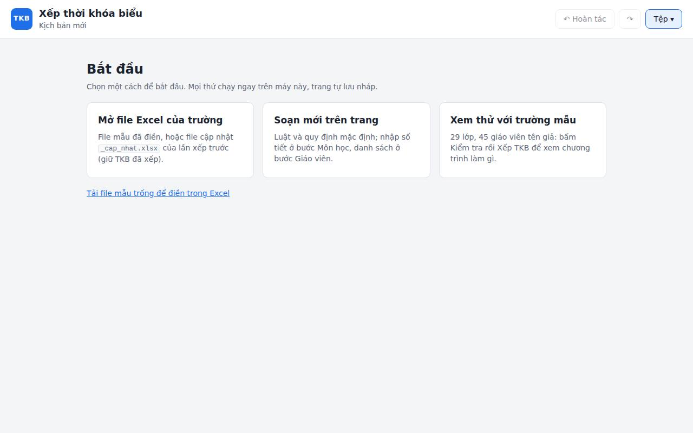

Mọi việc với file nằm ở menu **Tệp ▾** góc trên: Mở file Excel…, Lưu ra file Excel, Tải file mẫu trống (điền trong
Excel rồi mở lại), Bắt đầu lại…. Mở file thì hộp thoại cho chọn phần nào lấy từ file.

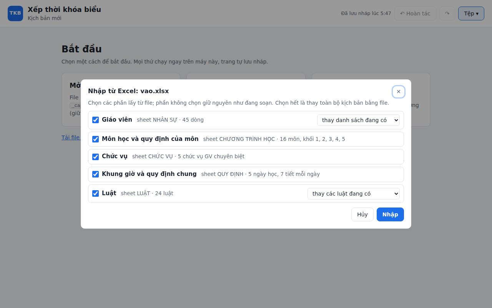

Rồi đi lần lượt các bước (nút **Tiếp →** cuối mỗi trang). Trang tự kiểm tra sau mỗi lần sửa: bước nào có lỗi thì tên
bước có dấu **⚠** kèm số lỗi, đầu bước liệt kê các lỗi (bấm vào lỗi để tới đúng dòng, dòng lỗi tô đỏ nhạt); bước
không có lỗi có dấu **✓**. Sửa nhầm thì bấm **↶ Hoàn tác** (hoặc Ctrl+Z); xóa nhầm cũng hoàn tác được.

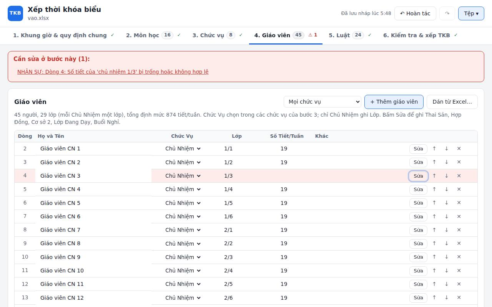

1. **Khung giờ & quy định chung**: số tiết buổi sáng, buổi chiều, ngày học, tiết HĐTN cố định, tiết luôn do GVCN
   dạy, ai được dạy bù.
   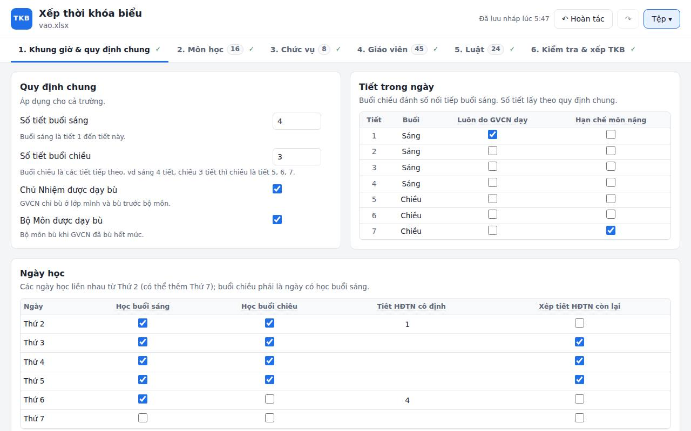
2. **Môn học**: số tiết mỗi khối; **Sửa** để mở các quy định của môn (ai dạy, môn nặng, ưu tiên buổi sáng…).
   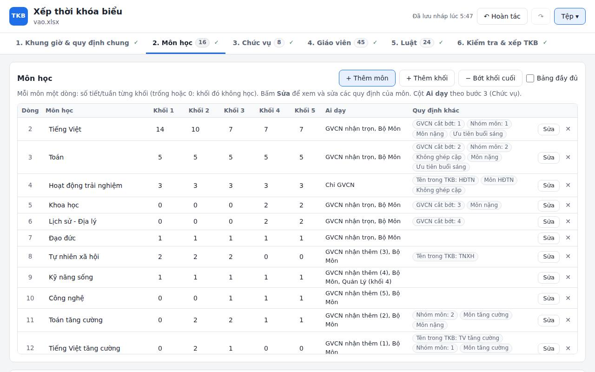
3. **Chức vụ**: Chủ Nhiệm, Bộ Môn, Quản Lý và các chức vụ GV chuyên biệt (vd Tiếng Anh, GV Nghệ thuật) với các môn
   được dạy.
   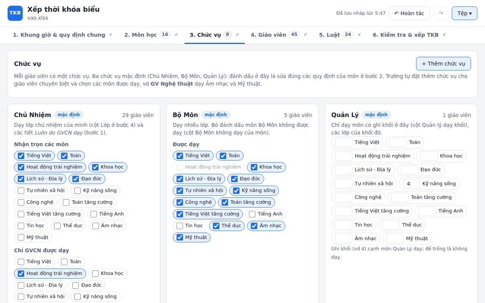
4. **Giáo viên**: họ tên, chức vụ, lớp chủ nhiệm, số tiết/tuần; **Sửa** để ghi thai sản, hợp đồng, cơ sở 2, lớp đang
   dạy, buổi nghỉ. Mỗi người có một **Mã GV** theo thứ tự dòng trong chức vụ, vd `Bộ Môn 3`, `Chủ Nhiệm 1/1`.
   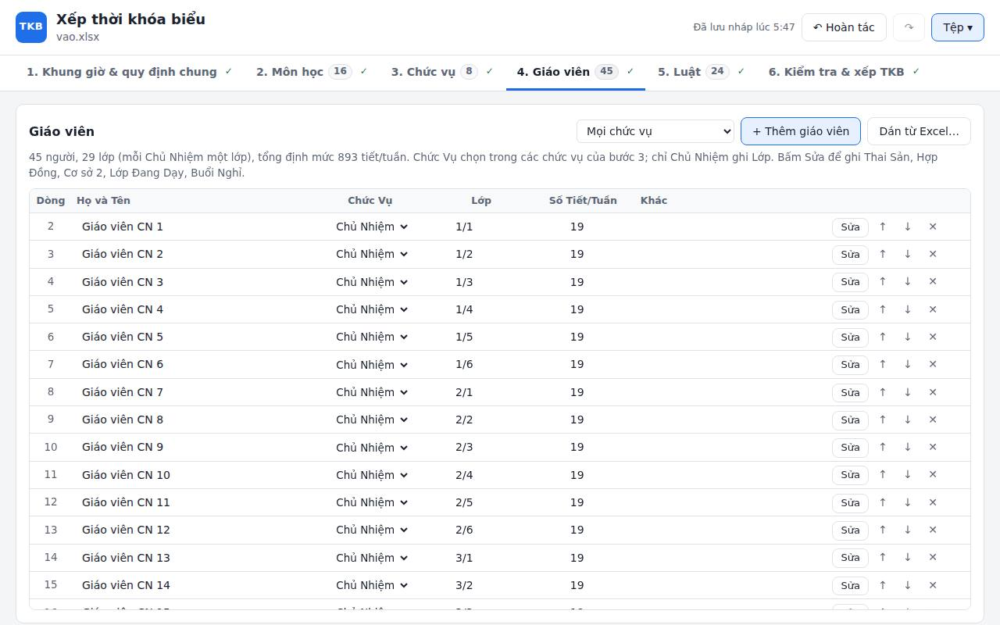
5. **Luật**: mọi luật xếp TKB, mỗi luật một câu dễ đọc, nhãn **Bắt buộc** hoặc **Ưu tiên** (thấp, vừa, cao, rất
   cao). Các luật mặc định đã đủ dùng; sửa số, đổi mức, bỏ hay thêm luật khi trường cần. Menu **Tệp luật ▾** để
   nhập, xuất luật ra Excel (chép luật sang trường khác) hay đưa các luật về mặc định.
   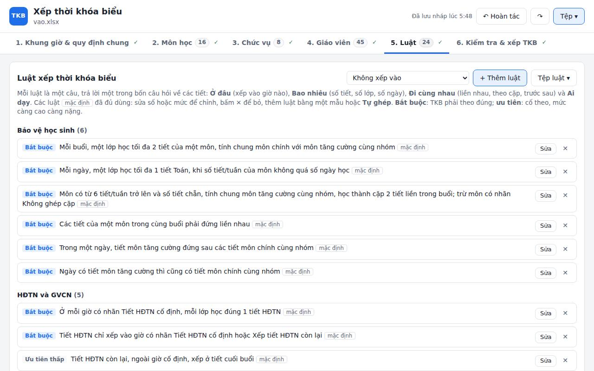

   **Thêm luật**: chọn loại luật rồi **+ Thêm luật**; hộp thoại hỏi lần lượt các tiết nào, vào giờ nào, thì sao, mức
   nào, và đọc lại ngay thành câu. Ví dụ **giờ bận** của một giáo viên: loại "Không xếp vào", Giáo viên `Bộ Môn 3`,
   Ngày Thứ 2, Tiết 1-2, để trống Môn.
   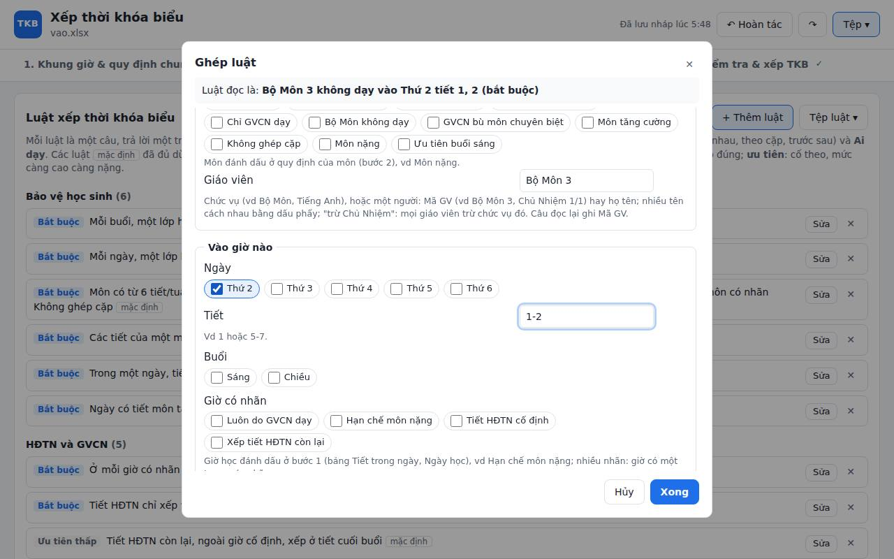
6. **Kiểm tra & xếp TKB**: chọn chế độ (bù giờ hay tuyển thêm), số tiết bù tối đa, thời gian; bấm **Kiểm tra** (vài
   giây): lỗi hiện kèm chỗ sửa (bấm vào lỗi để tới đúng dòng), cùng **dự toán** số tiết bù, tiết thiếu.
   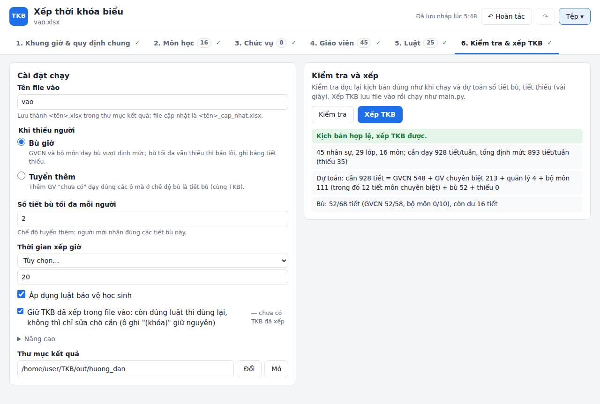

## 3. Xếp TKB và đọc kết quả

Bấm **Xếp TKB**. Mặc định chạy khoảng 10–15 phút (đổi ở ô Thời gian); muốn dừng sớm bấm **Dừng**: chương trình xếp
xong phần đang xếp rồi vẫn ghi TKB tốt nhất có được. Xong thì trang hiện **mã TKB** và các file ra, mỗi file có nút
**Mở** (bằng Excel) và **Tải**.

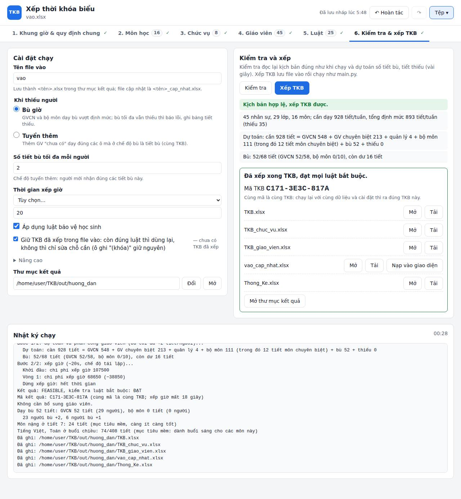

| File | Nội dung |
|---|---|
| `TKB.xlsx` | TKB theo lớp, mỗi khối một sheet; mỗi ô ghi môn và tên giáo viên |
| `TKB_chuc_vu.xlsx` | Cùng TKB, mỗi ô thêm Mã GV |
| `TKB_giao_vien.xlsx` | TKB của từng giáo viên, in mỗi người một trang; sheet Tổng hợp: cả trường ai dạy lúc nào |
| `Thong_Ke.xlsx` | Số tiết từng môn của mỗi người, ai dạy bù, ai còn dư; sheet **Chất lượng**: từng luật ưu tiên còn bao nhiêu chỗ chưa theo được |
| `<tên>_cap_nhat.xlsx` | File vào cập nhật: thêm người cần tuyển, cột kết quả, và **TKB đã xếp** để dùng lại lần sau |

Trường có lớp ở cơ sở 2 thì `TKB.xlsx` và `TKB_chuc_vu.xlsx` tách thành `_diem_chinh` (cơ sở 1) và `_diem_phu`
(cơ sở 2).

**Không xếp được**: chương trình chỉ ra những dòng luật không thể cùng thỏa (vd `LUẬT dòng 27: …`) và bỏ dòng nào là
đủ; nếu chỉ là thiếu thời gian thì báo tăng thời gian. **Bù giờ mà vẫn thiếu tiết**: không ra TKB, `Thong_Ke.xlsx` có
bảng tiết thiếu (lớp, môn, lý do); tăng số tiết bù tối đa, sửa nhân sự, hoặc chạy chế độ tuyển thêm.

## 4. Sửa giữa năm học

Luôn làm việc trên file **`<tên>_cap_nhat.xlsx`** của lần chạy trước (**Nạp vào giao diện** ở trang kết quả, hoặc
**Tệp ▾ › Mở file Excel…**): file này giữ TKB đã xếp.

- **Tuyển được người**: chỉ đổi chữ `chưa có` thành tên người mới (không đổi thứ tự dòng) rồi xếp: TKB giữ nguyên
  từng ô, mã TKB giữ nguyên, chỉ thêm tên.
- **Có thay đổi** (một người xin nghỉ một buổi, đổi định mức, sửa luật, sửa tay vài ô): chương trình **xếp lại ít xáo
  trộn nhất**, giữ mọi ô được, chỉ dời các tiết cần dời. Sheet **Thay đổi** của `Thong_Ke.xlsx` liệt kê các ô đổi.
- **Khóa ô**: ở sheet **TKB đã xếp** của file cập nhật, thêm chữ `(khóa)` vào cuối ô (vd dòng thứ hai `Bộ Môn 2
  (khóa)`): ô đó giữ nguyên bắt buộc khi xếp lại.
- **Giờ bận theo tiết**: luật "Không xếp vào", Giáo viên ghi Mã GV hoặc họ tên, Ngày và Tiết, để trống Môn.
- **Chọn ai dạy lớp nào**: luật "Chỉ giáo viên dạy", Môn, Lớp và một người, vd Tiếng Anh lớp 3/1 chỉ `Tiếng Anh 2` dạy.

Câu đọc lại và các thông báo luôn ghi Mã GV, không ghi họ tên. Mã GV đánh số theo thứ tự dòng trong chức vụ, nên thêm
hay xóa dòng nhân sự làm đổi Mã GV của những người phía sau: luật dùng lâu dài nên ghi họ tên.

## 5. Mã kết quả, máy Windows và máy Linux

Mỗi lần xếp in một **mã TKB** (mã kết quả, vd `08F4-E2C6-3470`): cùng file vào, cùng cài đặt thì chạy lại bao
nhiêu lần, trên máy nào cùng hệ điều hành cũng ra cùng TKB, cùng mã. Máy nhanh hay chậm chỉ chạy lâu hơn. Riêng **Windows và
Linux ra TKB khác nhau** (đều đúng mọi luật, cùng phân công) vì thư viện xếp giờ OR-Tools tính khác nhau một chút
trên hai hệ điều hành. Muốn có lại đúng TKB của máy kia: nạp file `_cap_nhat.xlsx` của máy đó, TKB được dùng lại
nguyên vẹn.
